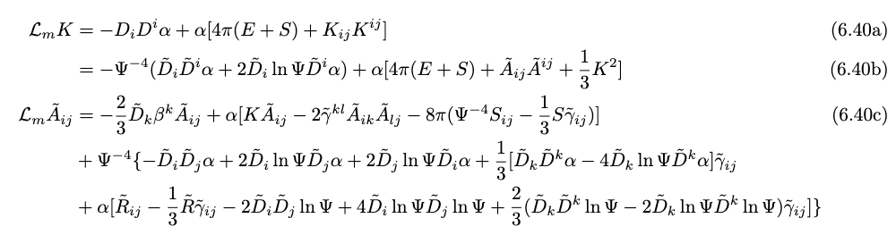

# $3+1$ Conformal Decomposition of GR

*In this chapter, we discuss about the $3+1$ conformal decomposition of GR which is extremely useful for the initial data and evolution problems.*

Key concepts that will be covered in this chapter:
1. Conformal decomposition of $3$-metric and background metric
2. Traceless and conformal decomposition of extrinsic curvature
3. Conformally decomposed $3+1$ EFE
4. ISM approximation of GR

## Introduction

One of the huge problem with normal ADM formulation was it's unstability for long-term numerical simulations. In $1987,$ Nakamura and Kojima presented a reformulation of ADM evolution equations. It was unnoticed untill after many year, this formulation showed an incredible long-term stability over normal ADM eqs. 

The more common version of this formulation is based on the work of Shibata and Nakamura, and Baumgarte and Shapiro, and is commonly known as the **BSSN (Baumgarte, Shapiro, Shibata and Nakamura)** formulation. This formulation has also been called **“conformal ADM.”**

## Conformal decomposition of the metric

*We first write the conformal decomposition of metric.*

- Let's start by conformal rescaling of *spatial* metric
$$\tilde{\gamma}_{ij} := \psi^{-4}\gamma_{ij}$$
 
  where $\psi$ is the conformal factor and it can be defind in different ways depending on the type of problem we wish to simulate. The *puncture* method, discussed during the NR tutorial sessions, utilizes conformal flat metric. 

  Therefore, there can be many ways in which we define our conformal factor. 
- One of key features of *BSSNOK* formulation is to choose the conformal factor such that the conformal metric $\tilde{\gamma}_{ij}$ has a *unit determinant*.
$$\psi^4 = \gamma^{1/3} \hspace{2mm} \implies \hspace{2mm} \psi = \gamma^{1/12}$$ 

  where, $\gamma$ is the determinant of $\gamma_{ij}$. **We also want that this relation is satisfied at all times during evolution.**
  
- *Problem*: Using the defination above, my $\psi$ is **not scalar**! Therefore, in order to solve it, I introduce a background metric $\textbf{f}$ on my hypersurface $\Sigma_t$.
 There are certain properties associated with $\textbf{f}$ for which one can refer to SB's NOTES

## Conformal connection and Ricci tensor

*In order to find conformal EFE, I need conformal connection and Ricci tensor.*

- Try to remember the relation between physical and conformal covariant derivative which was done in GR exercise during first semester. There we first built/derived connection
$$C^k_{ij} := \Gamma^{k}_{ij} - \tilde{\Gamma}^{k}_{ij} = \frac{1}{2}\gamma^{kl}(\tilde{D}_i\gamma_{lj} + \tilde{D}_j\gamma_{il} - \tilde{D}_l\gamma_{ij}) = 2(\delta^k_i\tilde{D}_i\ln\Psi^4 + \delta^k_j\tilde{D}_j\ln\Psi^4 - \tilde{D}^k\ln\Psi\tilde{\gamma}_{ij})$$

- Now, we can build a relation between physical and conformal Ricci tensor

- Finally, we can define Ricci scalar as
$$\tilde{R} := \tilde{\gamma}^{ij}\tilde{R}_{ij} = \Psi^{-4}\tilde{R} - 8\Psi^{-5}\tilde{D}_i\tilde{D}^i\Psi$$

## Traceless & conformal decomposition of extrinsic curvature

*Here, I am decomposing the extrinsic curvature $(K_{ij})$*. 

- Start by decomposing $K_{ij}$ in its trace and traceless part $A_{ij}$

- Then, I decompose the "up-up" contraction, $A^{ij} := \gamma^{ik}\gamma^{jl}A_{kl}$

- Therefore, tracefree part $A_{ij}$ has expression
$$\boxed{A_{ij} := K_{ij} - \frac{1}{3}K\gamma_{ij}}$$ 

- Finally, we make a conformal rescaling of the traceless extrinsic curvature 
$$\boxed{A^{ij} := \Psi^p\tilde{A}^{ij}}$$
where, 
$p = -4$ or $-10$, based on evolution equation or momentum contraints respectively. 

### Kinematical equation rescaling

- We start with the kinematical eq in conformal variables, and then multiply by $\Psi^{-4}$. Then further calculations lead to 

- Important Point: Here, we hve used the relation
$$\tilde{A}^{ij} = \Psi^4A^{ij}$$

### Momentum constraint rescaling

- Since, momentum constraint consists the divergence of extrinsic curvature, we utilize that and find

- Important Point: Here, we have used the relation
$$\hat{A}^{ij} = \Psi^6\tilde{A}^{ij}$$

## Conformal $3+1$ EFE

*This section includes the required equations for conformal description of EFE.*

Let's write down the equations we need:
1. Evolution equations for the conformal factor and the conformal metric derived from the kinematical eqs.

2. Evolution equations for the trace $K$ and the conformal extrinsic curvature $\tilde{A}_{ij}$ with scaling $p = −4$;

3. Lichnerowicz equation for the conformal factor as Hamiltonian constraint or, alternatively, a similar equation for the $\tilde{A}_{ij}$ with scaling $p = −4$;

4. Momentum constraint for the conformal extrinsic curvature $\hat{A}_{ij}$ with scaling $p = −10$ or, alternatively, a similar equation for the  ̃Aij with scaling $p = −4$.

Now, we have already derived three equations, meaning we have equations from $(1)$ and $(4)$.

**TASK: Deriving the remaning equations.**

### Hamiltonian constraint

- For this, we start with Hamitonian constraint then find $K_{ij}K^{ij}$. 
Also, then we write the expression for conformal decomposed Ricci scalar. After resummation we get

- Alternatively, one can use $p = -10$ rescaling an get  

  - The above equation is generally regarded as the *nonlinear elliptic equation* for the *conformal factor*.
  - One can simplify the LE by considering *maximal slicing* $(K = 0)$. 
  - One can also ask questions regarding the *well-posedness* and *uniqueness* of BVP for LE under *constant mean curvature (CMC)* where $K = \text{constant}$. Therefore, these problems have been studied in details.
  - All the problems related to NR such as, *asymptotically flat*, *closed manifolds* and *aymptotically hyperbolic* are solvable for this LE. 
  - For details, refer to a paper mentioned in SB's notes. 

### Conformal rescaling of energy and momentum 

- From the above context, it is clear that we want to conformally decompose our energy and momentum, so that we get a unique solution.

- Now, obviously we would ask about the choice for $s$. A possible choice would be $s = 8$.

- This can be thought as an implication of the conformally decomposed momentum constraint. 

- Therefore, we have following results
$$\tilde{E} := \Psi^8E \hspace{2mm} \text{and} \hspace{2mm} \tilde{P}^i := \Psi^{10}P^i$$

- *Dominant energy conditions* are also satisfied if one uses the conformal rescaling of energy and momentum.

### Dynamical Equations

- Finally, we write the dynamical eqs. which are obtained by splitting 

and we get 

**Therefore, we have derived all the required evolution eqs.** 

*For further explaination and derivation, one can refer to SB's notes!*

