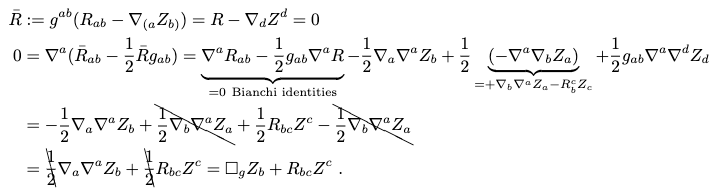
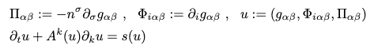
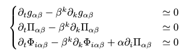
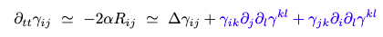
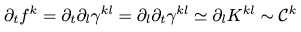
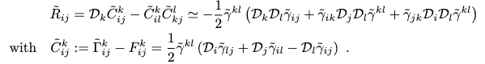
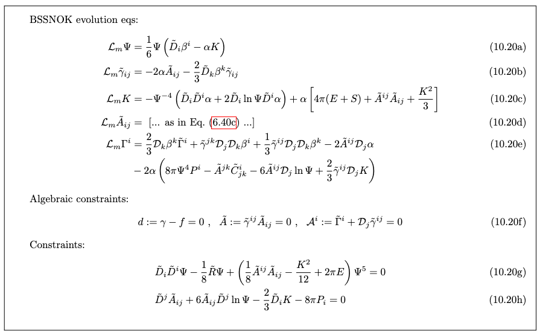

# Hyperbolic Free Evolution Scheme

*Basic idea behind this chapter is to look into the two evolution scheme commonly employed in NR. Moreoever, we will try to reduce all our equations to strongly hyperbolic.* 

Q. How to solve initial slices?
A. There are two methods: Constraint schemes (elliptic + hyperbolic) and Free evolution schemes (linear hyperbolic).

Let's start with the most common approach towards solving EFE:

## Free Evolution Schemes

FE's approach:
- By solving the constraints, we define our initial slice at $t = 0$.
- Later, we solve all the 12 evolution equations for $\gamma_{ij}$ and $K_{ij}$ as we advance in time giving us the spacetime at successive times.

Because of Bianchi identites, we concluded that the constraints remain satisfied throughout the evolution, but since we are interested in numerical simulations, we want it to be true even after discretizing the $3+1$ equations. However, this discretised version doesn't exist, therefore we have live with the fact that it remains satisfied.

**Theorem**: *A strongly hyperbolic PDE system admits a well-posed Cauchy problem (IVP)*.

From the above theorem, we want our equation to be **strongly linear hyperbolic** so that they admit a well-posed Cauchy problem. 

Regarding the strongly hyperbolic equations, we can define it as:

"*A second-order system of PDEs is strongly hyperbolic iff the principal part (highest derivatives) is in the form $\Box_g u \simeq 0$.*"

Another alternative that can be employed is the **symmetric hyperbolic system**. It utilizes the concept that I have to diagonalize the hyperbolic system

$$\partial_tu + A^i(u)\partial_iu = 0$$

Therefore, I have to diagonalize the $A^i(u)$ matrix. 

Now, the two formulations for the *free evolutions* that we discuss are:

1. Generalised Harmonic Gauge (GHG)
2. BSSNOK Scheme

Both of the schemes are heavily employed in the astrophysical application. Refer to BB's Notes for detailed information regarding the application. 

### Generalised Harmonic Gauge (GHG)

- For applying this scheme we work in *vaccum*.

- Start with EFE in vacuum $R_{ab} = 0$ along with the expression for Ricci tensor:
$$R_{ab} = \underbrace{-\frac{1}{2}g^{cd}\partial_c\partial_d g_{ab} + \nabla_{(a}\Gamma_{b)}}_{\text{principal part}} + g^{cd}g^{ef}\left(\partial_e g_{ca}\partial_f g_{db} - \Gamma_{ace}\Gamma_{bdf}\right)$$

  Yeah, the principal part corresponds to the terms with double derivative. In this case, it's the double derivate terms with $g_{ab}$

  where, 

  $$\Gamma_a := g^{bc}\Gamma_{abc}  , \nabla_a\Gamma_b = \partial_a\Gamma_b - g^{cd}\Gamma_{cab}\Gamma_d$$

- Since, the above equation has an extra term, so I impose Harmonic gauge condition which imposes that the above equation is strongly hypebolic:
$$\Gamma_a \equiv 0$$

  we finally get 
  $$\boxed{-\frac{1}{2}\Box_gg_{ab} := 0}$$

- After working out with the above two steps, we get symmetric hyperbolic system of 10 eqs and 4 constraints. 
$$\Box_g g_{\alpha\beta} := g^{\gamma\delta}\partial_{\gamma}\partial_{\delta}g_{\alpha\beta} = 2g^{\gamma\delta}g^{\sigma\rho}\left(\partial_{\sigma}g_{\gamma\alpha}\partial_{\rho}g_{\delta\beta} - \Gamma_{\alpha\gamma\sigma}\Gamma_{\beta\delta\rho}\right)$$
$$\mathcal{C}_{\alpha} := \left(R_{\alpha\beta} - \frac{1}{2}g_{\alpha\beta}R\right)n^{\beta} = 0$$

- Finally, we are position to work with *generalised harmonic gauge*, implying
$$\Gamma_{a} \equiv H_{a}.$$

  This choice of harmonic gauge also leads to *symmetric hyperbolic system*! 

- Define the constraint as, 
$$Z_{a} := H_{a} - \Gamma_{a}$$
  it's not similar to previous case but makes thing more generalised. 

- Write the EFE as the equivalent sytem:
$$\bar{R}_{ab} := R_{ab} - \nabla_{(a}Z_{b)} = 0, \hspace{2mm} \text{and} \hspace{2mm} Z_{a} = 0$$

- Bianchi identites gurantees that GHG gauge is maintained along the evolution if the Bianchi identities guarantees that GHG gauge is maintained along the evolution if initially $Z_a = \dot{Z}_a \equiv 0$ because the algebraic constraint evolves according to a linear wave equation:

- The approach followed here is same as $Z4$ system. In general, the vector $Z_a$ can be evolved in the $Z4$ scheme and one can add further equations for the lapse and shift.
Define:

Finally, we get

### ADMY (+gauge)

ADMY is strongly hyperbolic under certain conditions:
1. $\bar{\beta}$ shift vector is prescribed.
2. $\alpha$ is Bona-Mass family or $\bar{\alpha} = \alpha/\sqrt{\gamma}$ is prescribed.
3. $\mathcal{C^i} = 0$ along the evolution. IN the case of free scheme we cannot impose this condition. Therefore, ADMY is **weakly hyperbolic!** Concluding, there is no well-posedness!

**Q. How to make our system strongly hyperbolic?**
A. Consider:

Now, I have to make the blue terms equal to zero so that I can have a strongly hyperbolic equation. To perform this we have a series have steps:

- Define a new variable:
$$f^k := \partial_l\gamma^{kl}$$

- Now, let's find the evolution equation for $f^k$:

  the natural way to obtain the new equation is to use the momentum constraint. The time derivative of the auxliary variable becomes then proportional to the momentum constraint. 

**IMPORTANT POINT: BSSNOK method uses the similar approach as above but we use conformal variables instead of normal variables.**

Therefore, we define an *auxillary conformal variable.*

$$\tilde{\Gamma}^i := -\mathcal{D}_j\tilde{\gamma}^{ij} = (\tilde{\Gamma}^i_{jk} - F^i_{jk})\tilde{\gamma}^{jk}$$

Therefore, after all the calculations we get the **BSSNOK evolution eqs.**
