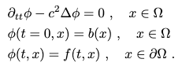
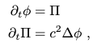
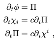

# Hyperbolicity and Well-Posedness 

Review of hyperbolic equations and well posedness of th *Cauchy problem*.

## Toy Model 

Hyperbolic eqns appear in IVP (Cauchy) problems. 

1. Define

   where, $\Omega$ is the domain and $d\Omega$ is the boundary of domain.

2. Reduce the second order wave equation to *first-order-in-time* and *second-order-in-space* system 

   This is what we encounter in $3+1$ GR.

3. I can further reduce the eqn to *first-order-in-time* and *first-order-in-space* by introducing few other variables. 

   where, $\chi_i := c\partial_i\phi$ which acts a **constraint**.

4. Finally, we write the above system in the matrix form:
$$\boxed{\partial_tu + A^i(u)\partial_iu = s(u)}$$

# Points discussed in class

1. Weakly Hyperbolic: Eigenvalues are real but we can not find its basis or nonexistence of set of eigenvectors. 
[E.g. ADMY]

2. If $A = A(u)$ says that are system is **non-linear**.

