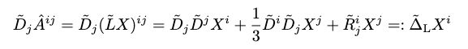
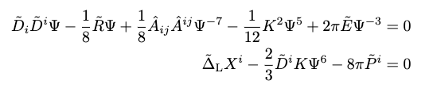
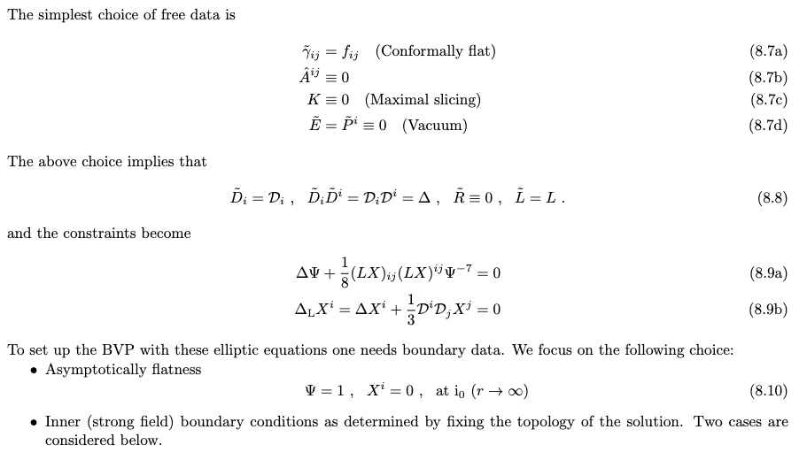
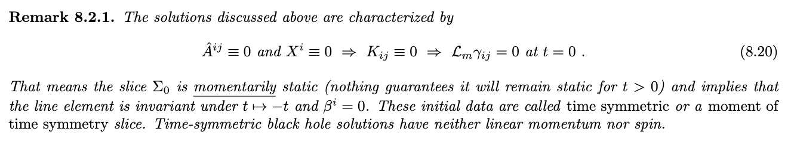

# Initial Data Problem

*This chapter deals with the initial data problem in 3+1 GR, i.e. the solution of constraints at some inital time.*

## Introduction

Previously, we saw that out of 10 EFE only 6 contain the time derivatives, meaning those eqs truly represent the time evolution of spacetime geometry. Apart from that, the remaining 4 equations are the constraints that **must be satisfied at all times**.

Q1. Why do are interested in the initial data?
A1. See, there are 12 dynamical variables $\left\{\gamma_{ij}, K_{ij}\right\}$ to choose as initial data, but the satisfaction of the contraint equations is a must. Therefore, we cannot arbitarily choose anything! This means that before starting an evolution, it is necessary to first solve the initial data problem to obtain adequate values of $\left\{\gamma_{ij}, K_{ij}\right\}$ that represent the physical situation that we are interested in. 

Let's start with the problem setup.

## Problem's setup

We have 4 constraint equations in 3+1 adapted coordinate system,

$$\mathcal{C}_{0} := R + K^2 - K_{ij}K^{ij} - 16\pi E = 0$$

$$\mathcal{C}_{i} := D_jK^j_i - D_iK - 8\pi P_i = 0$$

and we want to find $\gamma_{ij}$ and $K_{ij}$ (12 components in total) on $\Sigma_0$ such that:

- Constraint equations are satisfied. 
- Also, the solution should have a physical meaning, e.g. representing a BH or NS. 

Important points regarding these constraints: 
- They form a system of 4 coupled PDEs of **elliptic** type
- Solving them **isn't** easy.
- However, there are two methods to solve them and both are based on the *conformal decomposition*: 
  - **Conformal traceless transverse (CTT)** of York and Lichnerowicz 
  - **Conformal thin-sandwich approach (CTS)**

## Conformal Traceless Transverse (CTT)

- The heart of CTT approach lies in the decomposition of the conformal traceless extrinsic curvature $\hat{A}^{ij}$ $(p = -10)$ into *longitudinal* and *transverse* part:
$$\hat{A}^{ij} := \hat{A}_{L}^{ij} + \hat{A}_{TT}^{ij}$$

  where, $TT$ part is by defination traceless and transverse free
  $$\tilde{\gamma}_{ij}\hat{A}_{TT}^{ij} = 0, \hspace{2mm} \tilde{D}_{ij}\hat{A}_{TT}^{ij} = 0$$
  
  and the $L$ part is expressed in terms of the **conformal killing operator**
  $$(\tilde{L}X)^{ij} := \tilde{D}^iX^j + \tilde{D}^jX^i - \frac{2}{3}\tilde{D}_kX^k\tilde{\gamma}^{ij}$$
  
  where, $\tilde{\gamma}_{ij}$ represents the conformal metric and $X^i$ represents the vector field. **L part is also traceless and symmetric**.

- The above splitting is possible due to one of the important relations that can used for **symmetric-tracefree tensors**
$$S^{ij} := S^{ij}_{*} + (\tilde{L}X)^{ij}$$
where, $S^{ij}_*$ is symmetric, tracefree and *transverse* (i.e. zero divergence, $D_jS^{ij}_* = 0$) tensor.  

- We are given $\hat{A}^{ij}$, the L/TT decompositon is determined in two steps:
  - Taking the divergence $\tilde{D}_j\hat{A}^{ij} = \tilde{D}_j(\tilde{L}X)^{ij}$
  - Solving for $X^i$

- Finally, the constraint equations in CCT approach comes out as

- FREE DATA: $\tilde{\gamma}_{ij}$, $\hat{A}^{ij}_{TT}$, $K$, $E$, $P^i$
- CONSTRAINED DATA: $\Psi$, $X^i$

- Important Point: The **Lichnerowicz eq** is considered an equation for the conformal factor (*elliptic*, *quasilinear*); the **momentum constraint** is an *elliptic linear equation* for the $X^i$. The equations are *coupled* but under the *assumption* $K = \text{const}$ (hypersurfaces have *constant mean curvature, CMC*) the system *partially decouple*: one can solve first the momentum constraint and then plug the solution $X^i$ into the Lichnerowicz eq and solve for $\Psi$.

### Example related to above concepts

*There is a great example to understand the above concept where we make simplest choice of free data i.e. conformally and asymptotically flat and time-symmetric BH data.*

Finally, after the solving the whole problem we make a following remark

**Key Observation:** The BVP problem for this type of data is highly important because it utilizes two notions: 
1. No inner BC
2. BC on a inner ball 

#### Multiple BH: Brill-Lindiquist and Misner data

Now, after solving the above problem for single BH, we get conformal facror as

$$\Psi = 1 + \frac{a}{r}$$

where, 
$$M_{\text{ADM}} = 2a$$

**Therefore, since $\Psi$ is linear, I can superpose the solution and get another solution!**

$$\Psi = 1 + \sum^N_{h = 1}\frac{M_h}{|x^i - c^i_h|} := 1 + \Psi_{\text{BL}}$$